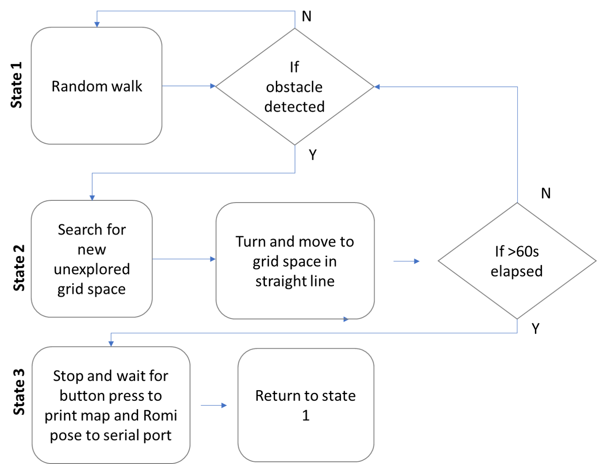

# RomiRobot_MovementAndMapping

## Contents

- Introduction

- Installation

- Guidance on use

## Introduction

This arduino script is provides movement and mapping functionality for the 'Romi' robot to be used in robotic systems coursework.

The main functionality is as explained below by the text and image:

- General Movement
    - Move in a straight line for 'x' encoder counts
    - Turn on the spot by 'x' degrees cw or ccw
- Mapping behaviour
    - Random walk until obstacle is detected whilst mapping
    - Attempt to move to to unexplored grid tile whilst mapping
        - if obstacle is detected repeat this step
    - Return to random walk and mapping behaviour
    - Stop periodically to print the current map over a serial connection
- Reporting
    - The romi robot periodically reports the current map over the serial connection
    - The romi robot continuous reports pose over bluetooth → PoseX (mm), Pose Y (mm), Orientation (degrees)

## Installation

1. This code uses gausians and requires that Ivan Seidel's 'Gaussian' library is installed. Download it here: https://github.com/ivanseidel/Gaussian. Installation instructions are on the github page.

2. Run this script

3. Download(zip) or clone this repository and extract to your computer.

4. Open with the arduino IDE

5. Upload to arduino Romi robot

## Guidance on use

**Note**: that the kalman filter has not yet been included and implemented

- To use the Mapping behaviour run the code as provided
- To use the general movement behaviour
    - 'comment out' case 4-5 of the switch case statement (lines 258 → 304)
    - 'uncomment' case 4-6 of the switch case statement (lines 308 → 334) and alter as necessary using the example format provided